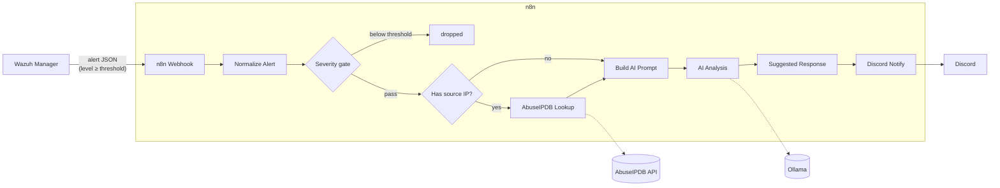

# SOC-Automation

[](LICENSE)

An AI-assisted, self-hosted SOC triage pipeline: **Wazuh** detects, **n8n** orchestrates, **AbuseIPDB** + a self-hosted **Ollama** LLM enrich and summarize, **Discord** notifies. Fully read-only — nothing in this pipeline takes automated action against your infrastructure. Every alert is a suggestion for a human to review.



## What it does

1. **Ingest** — Wazuh's `wazuh-integratord` forwards every alert at or above a configurable severity threshold to an n8n webhook via a custom integration script.
2. **Normalize** — flattens Wazuh's nested alert JSON into a predictable shape.
3. **Severity gate** — drops anything below your threshold (defaults to level 7).
4. **Enrich (AbuseIPDB)** — looks up the source IP's abuse confidence score, country, ISP, and report count. Skips gracefully if there's no source IP (e.g. local auth events).
5. **AI triage (Ollama)** — a self-hosted LLM (default: `llama3.1:8b`) reads the alert + AbuseIPDB context and produces a short triage summary and a priority call. No API key, no per-request cost, no data leaves your network.
6. **Suggested response** — a rule-based classifier adds a plain-English "what to check next" hint based on the Wazuh rule's groups (auth failures, web, malware/rootkit, firewall/IDS), auto-escalated if AbuseIPDB confidence is high.
7. **Notify** — posts one formatted Discord embed per alert with everything above.

## Repo contents

```
SOC-Automation/
├── n8n-workflow-wazuh-soc.json   # Importable n8n workflow (placeholders — see DEPLOYMENT.md)
├── wazuh-integration/
│   ├── custom-n8n                # Shell wrapper Wazuh invokes
│   ├── custom-n8n.py              # Forwards the alert JSON to n8n's webhook
│   └── ossec-conf-snippet.xml    # <integration> block to add to ossec.conf
├── DEPLOYMENT.md                  # Full step-by-step setup guide
└── README.md
```

## Quick start

See **[DEPLOYMENT.md](DEPLOYMENT.md)** for the full walkthrough. In short, you'll need:

- A running Wazuh manager (v4.x)
- Docker on a host to run n8n
- Docker (or bare metal) on a host to run Ollama — CPU-only works, just slower
- A free [AbuseIPDB](https://www.abuseipdb.com/) API key
- A Discord webhook URL

## Known limitations

- **Ollama latency**: CPU-only inference on an 8B model takes 30-90+ seconds per alert. Fine for periodic security alerts, not real-time. Use a smaller model or GPU-backed hardware to speed this up.
- **AbuseIPDB free tier**: 1,000 lookups/day, one lookup per alert with a source IP.
- **No automated response by design.** The "Suggested Response" step is text only. Extending this pipeline to actually block IPs, kill sessions, etc. is a materially bigger risk decision and isn't part of this project.

## Security notes

- This pipeline is intended for **your own infrastructure, with proper authorization**. Don't point it at systems you don't own or manage.
- `n8n-workflow-wazuh-soc.json` as committed here has **placeholder** credentials — never commit your real Discord webhook URL or AbuseIPDB key. See `.gitignore`.
- The Wazuh manager, n8n, and Ollama should all sit on a private/trusted network (e.g. a VPN mesh like Tailscale) — none of them are designed to be exposed directly to the internet.

## License

[MIT](LICENSE) — use, modify, and distribute freely, including commercially, with attribution.
